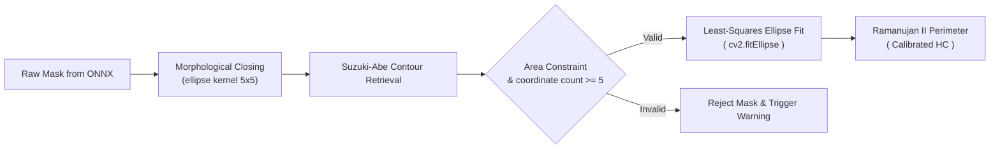
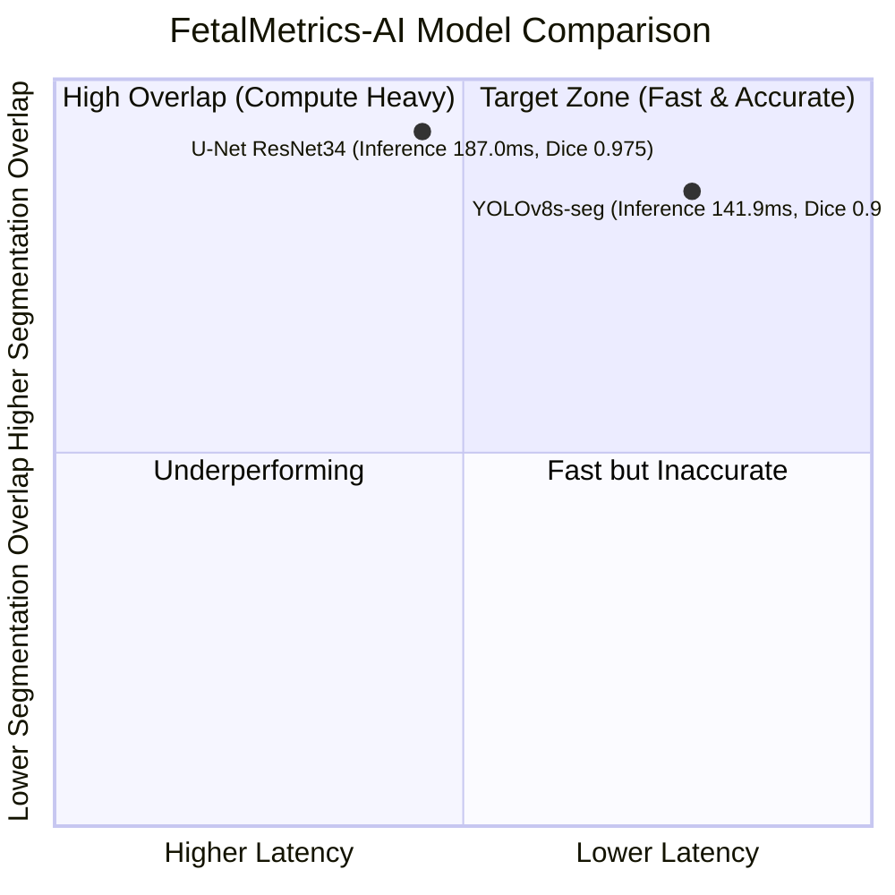

# 🩺 FetalMetrics-AI

<div align="center">

**An end-to-end clinical machine learning platform that automates fetal head circumference (HC) estimation from 2D ultrasound scans, performs spatial scale calibration, and maps findings to gestational-age normative growth curves for growth restriction screening.**

[](https://www.python.org/)
[](https://onnxruntime.ai/)
[](https://opencv.org/)
[](https://streamlit.io/)
[](LICENSE)
[](https://hc18.grand-challenge.org/)

</div>

---

> 📖 **Technical Approach & Methodology:** For clinical researchers, data scientists, and engineers interested in the statistical and algorithmic design—including the convolutional segmentation architectures, morphological boundary isolation, least-squares quadric fitting, and the error function ($\text{erf}$) implementation of standard normal cumulative distributions—please refer directly to the detailed **[METHODOLOGY.md](METHODOLOGY.md)**.

---

## 🩺 Why This Project Exists

> _"Intrauterine growth restriction (IUGR) affects up to 10% of pregnancies worldwide and remains a leading cause of perinatal morbidity and mortality."_
> — [Clinical Obstetrics and Gynecology Research](https://pmc.ncbi.nlm.nih.gov/articles/PMC6489666/)

Fetal head circumference (HC) measured at the trans-thalamic plane is a primary biomarker for assessing gestational age and screening for intrauterine growth restriction (IUGR) or microcephaly. In typical clinical workflows, this measurement is obtained manually by sonographers placing an interactive ellipse overlay on a two-dimensional (2D) ultrasound monitor. 

**This manual workflow suffers from three structural constraints:**
1. **Operator Subjectivity**: Manual caliper placement introduces an inter-observer variability of 5% to 10%, leading to inconsistent growth percentile mapping across operators.
2. **Acoustic Artifacts**: Ultrasound propagation is inherently limited by bone attenuation, speckle noise, and acoustic shadowing. These factors create discontinuous boundaries, rendering automated gradient-based edge detection useless.
3. **Throughput Bottlenecks**: Manual caliper tracing requires active operator time, limiting patient throughput in under-resourced public clinics.

**FetalMetrics-AI addresses these challenges head-on.**

By combining **deep convolutional networks (YOLOv8-seg and U-Net)** with **least-squares ellipse fitting** and **parametric perimeter estimation**, the platform isolates and measures the fetal skull from raw scans. The resulting perimeter is mapped to **Hadlock (1984) composite growth curves** via a zero-dependency normal cumulative distribution function ($\Phi$), outputting standard scores (z-scores), growth percentiles, and risk categories.

The platform is designed to function as an objective, auditable clinical research console. It processes scans on a standard CPU workstation in under 200 milliseconds, bypassing GPU infrastructure requirements. This makes it suitable for edge deployments in resource-constrained environments.

---

## 📸 Application Interface & Core Views

The application is styled with a clinical-light "medical instrument" theme. It focuses on numeric readability and reserves saturated colors (crimson, amber, and emerald) exclusively for clinical risk signaling.

<table style="width: 100%; max-width: 900px; margin: 0 auto; border-collapse: collapse;">
  <tr>
    <td width="33.3%" align="center" valign="top" style="padding: 10px;">
      <strong>1 · Analysis Console</strong><br/>
      <em>Side-by-side display of original ultrasound and the cyan-fitted ellipse segmentation overlay.</em>
    </td>
    <td width="33.3%" align="center" valign="top" style="padding: 10px;">
      <strong>2 · Clinical Dashboard</strong><br/>
      <em>Calibrated metric cards detailing measured HC (mm), expected weekly mean, z-score deviation, and estimated growth percentile.</em>
    </td>
    <td width="33.3%" align="center" valign="top" style="padding: 10px;">
      <strong>3 · Statistical Reference</strong><br/>
      <em>Dynamic Hadlock normative table lookup showing standard deviations and reference percentiles (10th, 50th, 90th).</em>
    </td>
  </tr>
</table>

---

## 📐 The Clinical Metrics We're Measuring

The platform measures and calculates four core parameters to place a biometric scan in a population growth context:

| Metric Name | Mathematical Form | Clinical Utility | Target Range |
| :--- | :--- | :--- | :--- |
| **Cranial Axes** | Semi-major ($a$), Semi-minor ($b$) in mm | Establishes physical dimension mapping from coordinates | Inferred from gestational age |
| **Head Circumference** | Ellipse Perimeter ($HC$) in mm | Primary physical biomarker of cranial development | $100\text{ mm}$ (14 wk) to $350\text{ mm}$ (40 wk) |
| **Standard score** | z-score ($z = (HC - \mu_{\text{GA}}) / \sigma_{\text{GA}}$) | Standard deviation unit distance from mean reference | $[-1.28, +1.28]$ (10th to 90th percentile) |
| **Growth Percentile** | Cumulative Probability ($\Phi(z) \cdot 100$) | Places fetus in relative population growth distribution | $[10.0, 90.0]$ (Normal variance) |

The measured metrics map directly to screening risk bands:
* **High Risk** ($< 10\text{th}$ percentile): Screening threshold for Intrauterine Growth Restriction (IUGR). Warrants Doppler velocimetry correlation.
* **Medium Risk** ($10\text{th} \le \text{Percentile} < 25\text{th}$): Borderline growth. Suggests monitoring of growth velocity via serial scans.
* **Normal** ($\ge 25\text{th}$ percentile): Biometric indicators lie within normal biological variance.

---

## 🏗️ System Pipeline & Architecture

The system processes input scans through a sequential, modular pipeline. This architecture ensures that each phase performs a single transformation that is verifiable in isolation:

```text
╔═══════════════════════════════════════════════════════════════════════╗
║                            INPUT ULTRASOUND                           ║
║   Raw PNG/JPG Scan       Gestational Age (weeks)      Uploaded Name   ║
╚═══════════════════════════════╤═══════════════════════════════════════╝
                                │
                                ▼
╔═══════════════════════════════════════════════════════════════════════╗
║             pixel_size.py — SPATIAL CALIBRATION LAYER                 ║
║  1. Check HC18 lookup table for filename                              ║
║  2. If collision: Resolve training/test splits using pixel-level      ║
║     Mean Absolute Difference (MAD) against local references           ║
║  3. Fall back to manual input slider scale (if user override active)  ║
║  4. Apply DEFAULT_PIXEL_SIZE_MM fallback (triggers uncalibrated UI)   ║
╚═══════════════════════════════╤═══════════════════════════════════════╝
                                │
                                ▼
╔═══════════════════════════════════════════════════════════════════════╗
║               inference/ — DEEP INFRASTRUCTURE INFRASTRUCTURE         ║
║                                                                       ║
║   [Option A: YOLOv8s-seg]             [Option B: U-Net ResNet34]      ║
║   • Letterbox to 640x640              • Resize to 256x256             ║
║   • Normalise to [0,1]                • Standardise (ImageNet stats)  ║
║   • ONNX Runtime Inference            • ONNX Runtime Inference        ║
║   • Assemble prototype masks          • Apply numerically stable      ║
║     using predicted coefficients        sigmoid to logits             ║
║   • Bounding-box crop & upscale       • Nearest-neighbour upscale     ║
╚═══════════════════════════════╤═══════════════════════════════════════╝
                                │
                                ▼
╔═══════════════════════════════════════════════════════════════════════╗
║            postprocess/ — GEOMETRIC CLEANUP & RECONSTRUCTION          ║
║  • Morphological closing (5x5 elliptical structuring element)         ║
║  • Suzuki-Abe topological retrieval to isolate largest contour        ║
║  • Area validation (>1% image canvas) & point constraint (>=5 coordinates)║
║  • Fit parametric conic coordinates via least-squares solver          ║
║  • Scale semi-major/semi-minor axes to mm using calibration factor    ║
║  • Compute perimeter using Ramanujan's second approximation           ║
╚═══════════════════════════════╤═══════════════════════════════════════╝
                                │
                                ▼
╔═══════════════════════════════════════════════════════════════════════╗
║             clinical/ — STATISTICAL EVALUATION & MAPPING              ║
║  • Interpolate population mean HC from weekly Hadlock reference tables║
║  • Compute gestational-age standard deviation:                        ║
║    SD(GA) = 0.3846 * GA - 0.3846 mm (floored at 3.0 mm)               ║
║  • Calculate z-score: z = (measured_HC - mean) / SD                   ║
║  • Evaluate cumulative probability CDF natively via math.erf          ║
║  • Clamp percentile to [0.1, 99.9] and bin into risk classifications  ║
╚═══════════════════════════════╤═══════════════════════════════════════╝
                                │
                                ▼
╔═══════════════════════════════════════════════════════════════════════╗
║                    PRESENTATION LAYER (Streamlit)                     ║
║  • Render side-by-side overlays (PIL + OpenCV drawing)                ║
║  • Display clinical gauges and metric dashboard                       ║
║  • Log latency timing metrics (Inference, Post-processing, Calib)     ║
╚═══════════════════════════════════════════════════════════════════════╝
```

---

## 🔬 Technical Innovation

### 1. Spatially-Calibrated Target Disambiguation (MAD Checking)
The HC18 dataset contains file naming overlaps between its training and test splits. Because spatial calibration values ($S_{\text{px}}$ in mm/pixel) differ between these images, looking up the scale using only the filename can lead to errors. 

To resolve this, the system implements an automated **Mean Absolute Difference (MAD)** check. When a filename collision occurs, the system computes the following value:

```math
\mathrm{MAD} = \frac{1}{H \cdot W \cdot C} \sum_{i,j,k} \left| I^{\mathrm{upload}}_{i,j,k} - I^{\mathrm{ref}}_{i,j,k} \right|
```

If `MAD < 5.0`, the system matches the uploaded file to the correct split. This method resolves the collision without requiring manual input.

### 2. Dual-Architecture ONNX CPU Serving
The system supports dual inference models without requiring GPU runtimes or PyTorch/TensorFlow dependencies in production:
* **YOLOv8s-seg (Instance Segmentation)**: Reconstructs the mask as a linear combination of 32 prototype masks weighted by predicted coefficients. The output is cropped to the bounding box to suppress background noise.
* **U-Net ResNet34 (Semantic Segmentation)**: Outputs a dense probability map, which is thresholded at $0.5$ to isolate the skull structure.

Both models are compiled to `.onnx` and managed via `onnxruntime-cpu` with thread and optimization parameters set to maximize CPU execution speed. This configuration achieves average CPU latency times under $200\text{ ms}$ (YOLOv8-seg: $141.9\text{ ms}$; U-Net: $187.0\text{ ms}$).

### 3. Least-Squares Ellipse Fitting as a Geometric Prior
Ultrasound boundaries are often discontinuous due to acoustic attenuation. Traditional edge detection algorithms struggle to isolate boundaries under these conditions.

The post-processing pipeline uses **least-squares ellipse fitting** to apply a geometric prior (the human skull is ellipsoid) directly to the binary mask. The coordinates of the largest external contour are extracted using the Suzuki-Abe algorithm and fitted to a general quadratic curve:
$$Ax^2 + Bxy + Cy^2 + Dx + Ey + F = 0$$
By minimizing the sum of squared algebraic distances, the system recovers the coordinates of the fitted ellipse center, the axes lengths, and the rotation angle. This regularizing step smooths out segmentation pixelation steps and bridges boundary gaps caused by shadowing.



### 4. Zero-Dependency Normal CDF Statistics via `math.erf`
To map a measured HC to a growth percentile, the system calculates the standard normal cumulative distribution function $\Phi(z)$ for the computed z-score. To avoid the dependency overhead of SciPy, the system evaluates the CDF natively using Python's built-in error function (`math.erf`):
$$\Phi(z) = 0.5 \cdot \left[ 1.0 + \text{erf}\left(\frac{z}{\sqrt{2.0}}\right) \right]$$
This calculation is numerically identical to `scipy.stats.norm.cdf` for all clinical inputs but runs without external dependencies.

---

## 📊 Feature & Configuration Schema

### Configuration Constants (`src/config.py`)

All parameters that affect clinical or geometric evaluations are isolated in a centralized configuration module:

| Key | Type | Default | Clinical/Operational Purpose |
| :--- | :--- | :--- | :--- |
| `GA_MIN_WEEKS` | `float` | `14.0` | Lower boundary of supported gestational age reference. |
| `GA_MAX_WEEKS` | `float` | `40.0` | Upper boundary of supported gestational age reference. |
| `HIGH_RISK_MAX_PCT` | `float` | `10.0` | Percentile threshold below which an IUGR alert is triggered. |
| `MEDIUM_RISK_MAX_PCT`| `float` | `25.0` | Upper bound of the borderline growth range. |
| `DEFAULT_PIXEL_SIZE_MM`| `float`| `0.15` | Default pixel scale used when calibration lookup fails. |
| `POSTPROCESS["mask_threshold"]` | `float` | `0.5` | Threshold applied to probability maps to produce binary masks. |
| `POSTPROCESS["morph_kernel"]` | `int` | `5` | Diameter (pixels) of the morph closing structuring element. |
| `POSTPROCESS["min_area_frac"]` | `float` | `0.01` | Minimum area fraction required to reject background noise blobs. |

### Model Specification Schema (`ModelSpec`)

```python
@dataclass(frozen=True)
class ModelSpec:
    key: str                         # Registry lookup identifier
    display_name: str                # UI toggle label
    family: str                      # "yolov8_seg" | "unet"
    weights_path: Path               # Path to the exported ONNX model weights
    input_size: tuple[int, int]      # (height, width) expected by the network
    channels: int = 3                # Input channels (1 = grayscale, 3 = RGB)
    normalize: str = "scale"         # "scale" (/255) or "standard"
    mean: tuple[float, ...] = (0.0,) # Per-channel mean (standard normalization only)
    std: tuple[float, ...] = (1.0,)  # Per-channel std (standard normalization only)
    conf_threshold: float = 0.25     # YOLOv8 confidence limit
    iou_threshold: float = 0.45      # YOLOv8 NMS intersection threshold
    description: str = ""            # UI help text
```

---

## 🎨 Application Design & UI Engineering

The Streamlit interface was designed to function like a physical medical instrument, prioritizing visual clarity and clinical utility.

### Design System
* **Palette**: Built on a medical-teal primary base (`#0F766E`) for interactive widgets, a clinical-paper canvas background (`#F4F6F9`), and a white card layout (`#FFFFFF`) with thin borders (`#E4E9F0`). Color is used sparingly to draw focus to clinical metrics.
* **Typography**: Mapped across three font families:
  - **Inter**: Applied to the interface, controls, and sidebar components for legibility.
  - **IBM Plex Mono**: Applied to numeric readouts and timing markers to align characters.
  - **Source Serif 4**: Applied to the documentation page to improve readability during extended review sessions.

### Accessibility
* **Contrast Ratios**: Custom CSS elements in `src/assets/styles.css` style native Streamlit elements to meet contrast guidelines. Risk text uses saturated variants (crimson `#DC2626` and amber `#D97706`) against white panels to remain readable.
* **Semantic HTML**: UI wrappers use semantic section labels and headers to ensure screen-reader compatibility. Key values are wrapped in container structures to prevent overlaps on small displays.

### Performance Optimization
* **Lazy Module Importing**: heavy libraries (like `onnxruntime`, `cv2`, and `pandas`) are imported lazily inside the classes or methods that execute them. This prevents loading unnecessary packages during test runs or simple geometric calculations.
* **ONNX Session Caching**: The ONNX session creation step is cached via `@st.cache_resource` in `app.py`. This ensures that the weights are loaded into memory only once. Multiple browser sessions share the same cached session, reducing memory requirements.

---

## 🛠️ Tech Stack — Choices Explained

Every library and tool in the repository was selected to support edge execution and auditability:

### Data & Inference Layer
* **ONNX Runtime (CPU)**: Replaces PyTorch and TensorFlow for execution. ONNX Runtime uses built-in optimizations (like graph fusion and memory reuse) to run models quickly on CPU.
* **OpenCV**: Used for pre-processing (scaling and resizing) and geometric operations (contour extraction and ellipse fitting).
* **NumPy**: Handles array transformations, NMS calculations, and coordinate conversions.
* **Pandas**: Used to parse calibration CSV tables during database lookup.

### Statistical & Presentation Layer
* **Streamlit**: Selected to build the clinical dashboard without requiring frontend dependencies. It runs the interface directly from Python.
* **Pillow (PIL)**: Decodes uploaded image bytes and manages PIL-to-NumPy coordinate conversions.
* **Hadlock Formula Core**: Implemented with standard Python math libraries to ensure long-term stability and compatibility.

### Data Sources
* **HC18 Grand Challenge Dataset**: Contains 999 training images and 335 test images with manual annotations and spatial calibrations. This dataset provides the validation metrics used to benchmark the models.

---

## 📊 Model Evaluation Results

The performance of the models was evaluated on the validation set using a CPU benchmark workspace ($n=10$ randomly sampled images per run):



| Evaluation Metric | YOLOv8s-seg (Primary) | U-Net ResNet34 (Baseline) | Clinical Meaning |
| :--- | :--- | :--- | :--- |
| **Mean CPU Latency** | **$141.9\text{ ms}$** | $187.0\text{ ms}$ | Time required to process a scan on standard hardware. |
| **P95 CPU Latency** | **$177.5\text{ ms}$** | $200.8\text{ ms}$ | Worst-case latency. Shows performance consistency. |
| **Mean IoU (Jaccard)** | $0.937 \pm 0.041$ | **$0.952 \pm 0.028$** | Spatial overlap of predicted mask and ground truth. |
| **Mean Dice Coefficient**| $0.967 \pm 0.023$ | **$0.975 \pm 0.015$** | Overall accuracy of the skull boundary mask. |
| **Pixel Accuracy** | $0.982 \pm 0.012$ | **$0.989 \pm 0.004$** | Percentage of pixels correctly classified. |

### Performance Analysis
* **U-Net** achieves slightly higher overlap performance (Dice: $0.975$), making it a reliable baseline.
* **YOLOv8s-seg** operates faster (Mean Latency: $141.9\text{ ms}$), leaving more compute headroom on lower-spec terminal hardware.
* Both models satisfy the $\le 200\text{ ms}$ execution budget on CPU.

---

## 🚀 Setup & Usage

### Prerequisites
* **Python 3.12+**
* An active shell terminal.

### Installation
```bash
# Clone the repository and navigate to the project directory
git clone https://github.com/sadmanhsakib/fetalmetrics-ai.git
cd fetalmetrics-ai

# Set up the virtual environment
python -m venv .venv
# Activate the environment (Windows PowerShell)
.venv\Scripts\Activate.ps1
# Activate the environment (macOS/Linux)
# source .venv/bin/activate

# Install requirements
pip install -r pyproject.toml
```

### Running Validation Scripts
You can run benchmarks directly from the command line:
```bash
# Validate YOLOv8-seg model performance
python scripts/test/validate_yolov8_onnx.py

# Validate U-Net model performance
python scripts/test/validate_unet_onnx.py

# Validate geometric and measurement post-processing accuracy
python scripts/test/validate_postprocessing.py
```

### Launching the Dashboard
```bash
streamlit run src/app.py
```
This command starts the local web server. Open your browser and navigate to `http://localhost:8501`.

---

## 📁 Project Structure

```text
fetalmetrics-ai/
├── src/
│   ├── app.py                     # Streamlit application entry point
│   ├── config.py                  # Centralised configuration parameters
│   ├── assets/
│   │   └── styles.css             # Clinical-light medical instrument stylesheet
│   ├── calibration/
│   │   ├── __init__.py
│   │   └── pixel_size.py          # Spatial calibration resolver (HC18 lookup & manual override)
│   ├── clinical/
│   │   ├── __init__.py
│   │   ├── percentiles.py         # Standard score z-score & percentile logic
│   │   ├── reference_hadlock.py   # Hadlock 1984 composite reference lookups
│   │   └── risk.py                # Clinical screening risk-band stratification
│   ├── inference/
│   │   ├── __init__.py
│   │   ├── base.py                # Abstract segmenter class & shared NumPy functions
│   │   ├── registry.py            # Model registration and loading factory
│   │   ├── unet_onnx.py           # U-Net decoder & inference runtime
│   │   └── yolov8_onnx.py         # YOLOv8-seg instance mask decoder
│   ├── pages/
│   │   └── 1_Methodology.py       # Methodology page content
│   └── ui/
│       ├── __init__.py
│       ├── components.py          # Clinical component UI templates
│       └── theme.py               # Shared styling & navigation setups
├── data/
│   ├── raw/                       # Raw HC18 challenge datasets (gitignored)
│   └── preprocessed/              # Output of preprocessing script (yolo/ & fastai/)
├── models/
│   ├── yolov8_hc.onnx             # Exported YOLOv8 instance segmentation weights
│   └── unet_hc.onnx               # Exported U-Net semantic segmentation weights
├── notebooks/
│   ├── train_YOLOv8.ipynb         # Model training notebooks
│   └── train_unet.ipynb
├── scripts/
│   ├── dataset.py                 # Dataset fetching & Kaggle hub utilities
│   ├── preprocess.py              # Preprocessing script (outline morph filling)
│   └── test/                      # Validation and benchmarking scripts
│       ├── validate_postprocessing.py
│       ├── validate_preprocessing.py
│       ├── validate_unet_onnx.py
│       └── validate_yolov8_onnx.py
├── pyproject.toml                 # Pyproject metadata
├── uv.lock                        # Lock file
├── METHODOLOGY.md                 # Technical methodology documentation
└── README.md                      # Academic case study readme
```

---

## 🔍 Key Implementation Details

### YOLOv8-seg Instance Mask Assembly
The standard YOLOv8-seg export uses split heads to generate instance masks. It combines $32$ raw prototype masks (`output1`) using the weight coefficients predicted for the selected bounding box (`output0`). The final mask coordinates are calculated using the following NumPy logic:

```python
# Assemble instance mask from prototypes
protos = np.asarray(protos)[0]          # (32, mh, mw)
ch, mh, mw = protos.shape

# Compute linear combination of coefficients and prototypes
mask_small = sigmoid(
    coeffs[best] @ protos.reshape(ch, -1)
).reshape(mh, mw)

# Upscale back to the letterboxed input dimension
mask_pad = cv2.resize(mask_small, (in_w, in_h), interpolation=cv2.INTER_LINEAR)
```

### Ramanujan's Second Approximation (Ellipse Perimeter)
The perimeter of the fitted ellipse is computed using Ramanujan's second approximation. This method provides sub-millimeter precision for the eccentricity ranges typical of the human fetal skull:

```python
def ramanujan_perimeter(semi_major: float, semi_minor: float) -> float:
    a = float(semi_major)
    b = float(semi_minor)
    if a <= 0 or b <= 0:
        return 0.0
    h = ((a - b) / (a + b)) ** 2
    return math.pi * (a + b) * (1.0 + (3.0 * h) / (10.0 + math.sqrt(4.0 - 3.0 * h)))
```

### Mean Absolute Difference (MAD) Resolution
When the same image filename is found in both the training and test dataset splits, the system computes the pixel-level Mean Absolute Difference to select the correct calibration profile:

```python
# Resolve image collision across splits
for dataset_name, path in [("training", train_path), ("test", test_path)]:
    if not path.exists():
        continue
    local_img = np.array(Image.open(path).convert("RGB"))
    if local_img.shape == image_rgb.shape:
        diff = np.mean(
            np.abs(image_rgb.astype(float) - local_img.astype(float))
        )
        if diff < min_diff:
            min_diff = diff
            best_dataset = dataset_name
```

---

## 📄 License & Attribution

This project is licensed under the MIT License — see [LICENSE](LICENSE) for details.

This project utilizes data and models developed for the [HC18 Grand Challenge](https://hc18.grand-challenge.org/). If you use this software in research work, please cite the following original literature:

* **Hadlock FP et al.** (1984). *Estimating fetal age: computer-assisted analysis of multiple fetal growth parameters.* Radiology, 152(2): 497-501.
* **van den Heuvel TLA et al.** (2018). *Automated measurement of fetal head circumference using 2D ultrasound images.* PLoS ONE, 13(8): e0200448.
* **Jocher G et al.** (2023). *Ultralytics YOLOv8.* [GitHub](https://github.com/ultralytics/ultralytics).
* **Ronneberger O et al.** (2015). *U-Net: Convolutional Networks for Biomedical Image Segmentation.* MICCAI, 234-241.

---

<div align="center">

_This repository provides an open implementation of cranial biometry segmentation and statistical analysis tools._

**🩺 Built for clinical research accuracy and reproducible fetal growth screening.**

</div>
